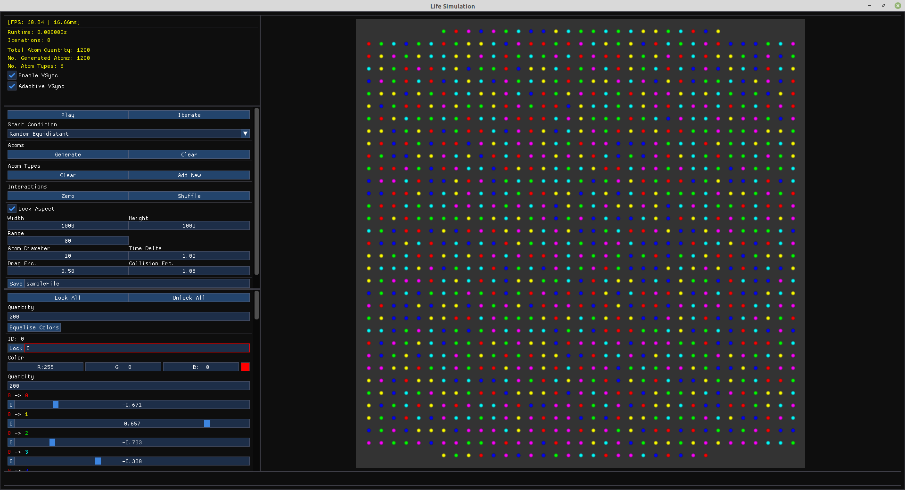
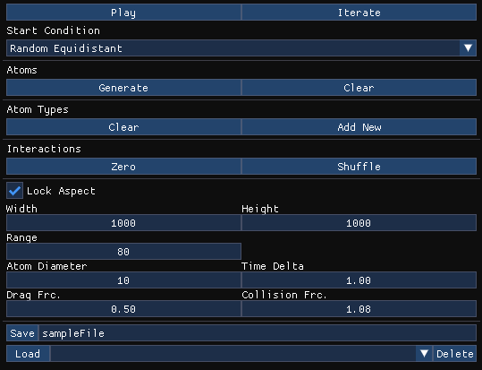
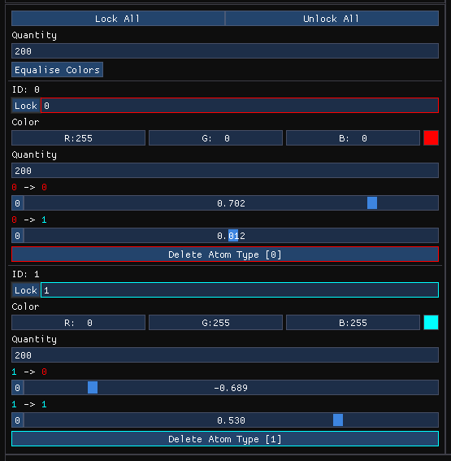

# ClustersSimulation

Based on Jeffrey Ventrella's Clusters simulation (see:
https://www.ventrella.com/Clusters/)

Inspired by this YouTube video on the topic (see:
https://www.youtube.com/watch?v=0Kx4Y9TVMGg)

## Usage

Compiling using cmake should create two executables (ClustersSimulation
and ClustersSimulation_GPU). The GPU version uses Shaders to execute
and render the simulation faster (the exact improvement depends on your
hardware but I've seen an improvement of ~10x).

The application will expect to find the `resources` directory in the same
working directory as the executable. Some features may not work correctly
if the `resources` directory is missing (but the application should still run).

The application also expects to find the `SimConfigs` directory in its working
directory (but will create it if not found). If you are missing any config files
make sure you didn't accidentally move/delete this directory, or move the
executable to a separate directory without this.

### Examples

The same configuration being run using different starting conditions:

| a | b |
| :-: | :-: |
|  |  |
| Random | Equidistant |
|  |  |
| Random+Equidistant | Rings |

### Running

The program should start with a default simulation layed out for you with
6 atom types and a total of 1200 atoms (or your previously loaded
configuration). You can run the simulation by either pressing **space bar**
or the **Play**/**Pause** button in the parameters panel.

### General Parameters

At the top of the parameters panel you will find buttons to apply general
operations to all atom types as well as numeric inputs for the simulation.

- **Play**/**Pause** - Start/stop the simulation (can also be done using the
**SPACE** button)
- **Iterate** - Perform a single iteration on the simulation
- **Atoms**
    - **Generate** - Re-initialize the simulation with new atoms and
randomize their positions. You will have to press this if you change the
number of atoms in the simulation, or if you add an atom type, in order to
update the simulation (this may be changed).
    - **Clear** - Remove all atoms from the simulation
- **Atom Types**
    - **Clear** - Remove all atom types and atoms from the simulation
    - **Add New** - Add a new atom type to the simulation (appended)
- **Interactions**
    - **Zero** - Set *all* atom type interactions to 0
    - **Shuffle** - Set *all* atom type interactions to a random value

---

- **Width**/**Height** - How large the simulation is (both directions)
- **Range** - How far (radius) the atoms must be from each other
in order to interact (same units as **Simulation Scale**)
- **Atom Diameter** - Diameter of each atom (used in both rendering and
- collisions), using the same units as **Width** and **Height**
- **Time Delta (dt)** - Lower values will make the simulation more technically
accurate, but may result in the simulation appearing to slow down
- **Drag Frc.** - How fast the atoms will lose velocity over time (0 will
stop them entirely, 1 will be no drag force)
- **Collision Frc.** - How strongly atoms will repel from each other when
overlapping (0 will result in no collisions)

---

- **Save** - Save the current configuration to the name specified in the
neighbouring text-box
- **Load** - Load a pre-existing configuration from the selected file

### Atom Parameters

- **Display Name** - What the atom will be called (shown above each interaction)
- **Colour** - The colour the atom will be displayed as
- **Quantity** - How many atoms of this type should be created
- ***a*->*b*** - How strongly does atom ***a*** attract (negative) or repel
(positive) atom ***b*** (assymetric: ***a*->*b*** != ***b*->*a***). Setting
to 0 will result in ***a*** ignoring ***b*** (except for collisions, if
enabled)
    + **Button** - Set interaction to 0
    + **Slider** - Set interaction to value between -1 and 1

### Limits

On the CPU version large amounts of atoms and/or many atom types will result in
a noticeable performance decrease (most noticeable at ~2000 atoms). On the GPU
version, only the number of atoms affects performance (~6000 for the same
performance decrease).

| Entity | Min | Max | Notes |
| ------ |:---:|:-----:| ----- |
| Atoms (total) | 0 | (3000 CPU, 10000 GPU) |  |
| Atom Types | 0 | 50 |  |
| Interactions | 0 | **Atom Types**\^2 |  |
| Scale | 10.0 | 1000000.0 |  |
| Atom Diameter | 1.0 | **Scale** / 2 | Will always render with a minimum diameter of 3. Collisions will still use the assinged value either way. |
| dt | 0.01 | 10.00 | Small values may be imperceptibly slow |
| Drag | 0.0 | 1.0 |  |
| I-Range | 1.0 | sqrt\(**Width**\^2+**Height**\^2\) |  |
| Collision | 0.00 | 10.00 |  |

## Installation

### Dependencies

This project makes use of the following dependencies:

- SDL2 - (https://www.libsdl.org/)
- Dear ImGui - (included in project) (https://github.com/ocornut/imgui)
- GLM - (included in project) (https://github.com/g-truc/glm)
- OpenGL (glad) - (download | https://glad.dav1d.de/) (OpenGL docs |
https://www.khronos.org/)

### SDL2

#### Linux

Follow the instructions at
(https://lazyfoo.net/tutorials/SDL/01_hello_SDL/linux/index.php)
to download SDL2. If you download using `apt-get` SDL2 should be placed in the
expected directory by default. If you download manually you will have to ensure
SDL2 is located somewhere CMake can find it, otherwise you may want to edit the
`CMakeLists.txt` file to look in the correct directory.

#### Windows

Follow the instructions at
(https://lazyfoo.net/tutorials/SDL/01_hello_SDL/linux/index.php)
to download SDL2. CMake expects to find SDL2 in the `c:/programs/sdl/`
directory.

### OpenGL (glad)

glad can be downloaded from (https://glad.dav1d.de/) and should be saved to
(`~/programs/glad/` on Linux, `c:/programs/glad/` on Windows), otherwise you
can edit `CMakeLists.txt` to search the directory you placed it in. The
language should beset to C/C++, the specification set to OpenGL, and the
profile set to Compatibility. The API should have gl set to version 4.6+,
and everything else set to None. To be safe you should enable all of the
extensions that appear, though it should work without (not tested!).

## License

MIT License

Copyright (c) 2022 Stuart Manfred Lewis

Permission is hereby granted, free of charge, to any person obtaining a copy
of this software and associated documentation files (the "Software"), to deal
in the Software without restriction, including without limitation the rights
to use, copy, modify, merge, publish, distribute, sublicense, and/or sell
copies of the Software, and to permit persons to whom the Software is
furnished to do so, subject to the following conditions:

The above copyright notice and this permission notice shall be included in all
copies or substantial portions of the Software.

THE SOFTWARE IS PROVIDED "AS IS", WITHOUT WARRANTY OF ANY KIND, EXPRESS OR
IMPLIED, INCLUDING BUT NOT LIMITED TO THE WARRANTIES OF MERCHANTABILITY,
FITNESS FOR A PARTICULAR PURPOSE AND NONINFRINGEMENT. IN NO EVENT SHALL THE
AUTHORS OR COPYRIGHT HOLDERS BE LIABLE FOR ANY CLAIM, DAMAGES OR OTHER
LIABILITY, WHETHER IN AN ACTION OF CONTRACT, TORT OR OTHERWISE, ARISING FROM,
OUT OF OR IN CONNECTION WITH THE SOFTWARE OR THE USE OR OTHER DEALINGS IN THE
SOFTWARE.

## TODO

### Additions

### Fixes

- Remove magic numbers in ImGui layout
- Remove Herobrine?

### 'Maybe' additions

- Improve speed of simulation's Second Pass Compute Shader (perhaps using
a quadtree-like system to reduce computations to only the neccessary ones)
- Use threading to separate simulation execution from window handling (to
prevent a low fps from hanging the application)
- Include different shapes/textures to render different atom types with
- Add a render mode which renders the atoms as blobs which 'blend' together
when close
- Add sound effects to buttons
- Implement compatibility with MacOS
